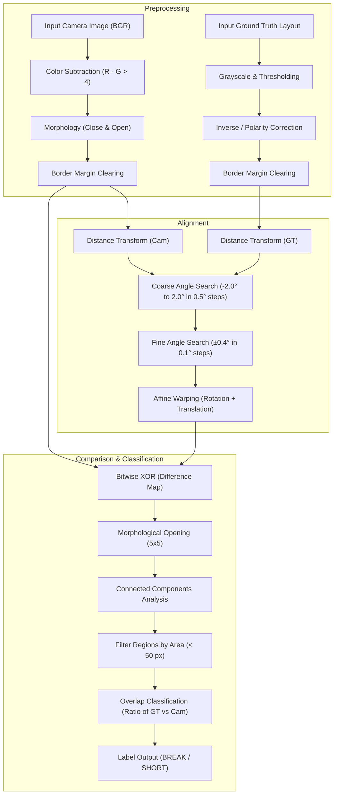

# PCB Fault Detection Pipeline Technical Documentation

This document provides a detailed technical explanation of the automated Printed Circuit Board (PCB) fault detection pipeline. The system aligns camera-captured board images to an ideal ground truth layout using a coarse-to-fine rotation search, segmenting and classifying trace faults (breaks and shorts) with high precision under variations in lighting, glare, sensor noise, translation, and rotation.

---

## 1. High-Level Architecture

The fault detection pipeline follows a five-step process to process, align, compare, and classify anomalies:

---

## 2. Preprocessing Subsystem

The input to the system consists of a camera-captured BGR image (which suffers from perspective, lighting, glare, and rotation issues) and an ideal ground truth BGR vector/layout image.

### 2.1 Glare-Invariant Binarization
Standard binarization techniques (like global Otsu thresholding or HSV-based segmentation) fail when intense light reflects off metallic copper traces. Glare causes the green substrate and copper traces to both desaturate and brighten, making their values overlap in standard color channels.

To overcome this, the pipeline utilizes the physical reflectance property of the board materials:
* **Green Substrate**: Reflects significantly more green than red ($G > R$, yielding a negative value for $R - G$).
* **Copper Traces**: Reflects significantly more red than green ($R > G$, yielding a positive value for $R - G$).

$$\Delta_{R-G} = R_{channel} - G_{channel}$$

The binary image $B_{cam}$ is obtained by applying a threshold of $4$ to the difference:

$$B_{cam}(x, y) = \begin{cases} 255 & \text{if } \Delta_{R-G}(x, y) > 4 \\ 0 & \text{otherwise} \end{cases}$$

This subtraction remains invariant even under extreme glare intensities, preventing holes inside traces and eliminating glare-induced false positives.

### 2.2 Morphological Cleanup
To remove sensor noise and fill tiny sub-pixel gaps inside the binary traces, morphological closing and opening operations are applied using a $3 \times 3$ rectangular structuring element:

$$B_{cleaned} = (B_{cam} \bullet K_{3\times3}) \circ K_{3\times3}$$

* **Closing ($\bullet$)**: Fills small holes and gap noise inside the copper.
* **Opening ($\circ$)**: Eliminates salt-and-pepper noise in the background.

### 2.3 Polarity Correction (Ground Truth)
The ground truth image is converted to grayscale and thresholded. Because ground truth files sometimes use light backgrounds with dark traces (or vice-versa), the pipeline evaluates the white-pixel density. If the white percentage exceeds $50\%$, the binary mask is automatically inverted using a bitwise NOT, ensuring that traces are always represented by white pixels ($255$) on a black background ($0$).

### 2.4 Border Margin Clearing
Both the camera and ground truth binaries are processed to zero out a 10-pixel margin along all four edges:

$$B(x, y) = 0 \quad \text{if } x < 10 \text{ or } x > W-10 \text{ or } y < 10 \text{ or } y > H-10$$

This prevents shadows, borders, or cropping lines along the image edges from being falsely detected as defects.

---

## 3. Coarse-to-Fine Alignment Subsystem

Imaging setups introduce translation offsets ($\Delta x, \Delta y$) and rotation angles ($\theta$). Phase correlation on binary images alone is highly sensitive to rotation. To make the alignment robust, the pipeline runs a **coarse-to-fine angular search** combined with **distance transform phase correlation**.

### 3.1 Distance Transform
Instead of correlating raw binaries, both images are transformed into distance maps using the Euclidean Distance Transform (L2 norm). In the distance transform, each pixel contains its Euclidean distance to the nearest background pixel:

$$D(x, y) = \min_{(u, v) \in \text{Background}} \sqrt{(x-u)^2 + (y-v)^2}$$

This creates smooth gradients from the center of the traces outward, providing a continuous surface that maximizes the overlap response in phase correlation.

### 3.2 Coarse-to-Fine Angular Search Algorithm
To find the rotation angle $\theta \in [-2.0^\circ, 2.0^\circ]$ and translation ($dx, dy$):

1. **Coarse Search**:
   * Loop through angles $\theta_{coarse} \in \{-2.0^\circ, -1.5^\circ, -1.0^\circ, -0.5^\circ, 0.0^\circ, 0.5^\circ, 1.0^\circ, 1.5^\circ, 2.0^\circ\}$.
   * Rotate the ground truth binary $B_{gt}$ by $\theta_{coarse}$ using `cv2.getRotationMatrix2D` around the image center.
   * Pad both images to match dimensions and compute their distance transforms.
   * Run phase correlation `cv2.phaseCorrelate` to find translation $(dx, dy)$ and the correlation peak response value $r$.
   * Select $\theta_{coarse\_best}$ that yields the highest correlation response $r$.

2. **Fine Search**:
   * Refine around the best coarse angle: search $\theta_{fine} \in [\theta_{coarse\_best} - 0.4^\circ, \theta_{coarse\_best} + 0.4^\circ]$ in steps of $0.1^\circ$.
   * Compute rotation and phase correlation translations.
   * Identify the final parameters $(\theta_{opt}, dx_{opt}, dy_{opt})$ that maximize the correlation response.

3. **Warping**:
   * Apply the optimal rotation to the ground truth binary:
     $$B_{rot} = \mathcal{W}_{rot}(B_{gt}, \theta_{opt})$$
   * Apply the translation using affine warping:
     $$B_{aligned} = \mathcal{W}_{trans}(B_{rot}, -dx_{opt}, -dy_{opt})$$

This alignment method achieves sub-degree rotation accuracy and pixel-level translation correction.

---

## 4. Difference Mapping and Morphological Filtering

Once aligned, the camera binary $B_{cam}$ and the aligned ground truth binary $B_{aligned}$ are compared using a bitwise XOR operation:

$$D_{raw} = B_{cam} \oplus B_{aligned}$$

A value of $255$ in $D_{raw}$ represents a mismatch (where copper is present in one image but not the other).

### 4.1 Opening Operation
To eliminate minor edge mismatches (which can still occur at the sub-pixel scale due to discretization), a morphological opening operation is applied using a $5 \times 5$ square kernel:

$$D_{filtered} = D_{raw} \circ K_{5\times5}$$

This successfully removes any thin borders or tiny misalignments while keeping real defects, which are structurally larger.

---

## 5. Connected Component Analysis & Defect Classification

To identify and label each defect:

1. **Connected Component Labeling**:
   * The pipeline scans $D_{filtered}$ using 8-connectivity to extract isolated defect blobs:
     $$\{R_1, R_2, \dots, R_N\} = \text{ConnectedComponents}(D_{filtered})$$

2. **Area Filtering**:
   * Only regions with an area larger than 50 pixels are considered active defects, eliminating high-frequency noise:
     $$\text{Area}(R_i) \ge 50$$

3. **Defect Classification**:
   * For each valid defect region $R_i$, the pipeline calculates the overlap with the camera binary $B_{cam}$ and the aligned ground truth binary $B_{aligned}$:
     $$\text{Overlap}_{gt} = \sum_{(x, y) \in R_i} B_{aligned}(x, y)$$
     $$\text{Overlap}_{cam} = \sum_{(x, y) \in R_i} B_{cam}(x, y)$$
   * **BREAK**: If the defect region has more overlap with the ground truth than the camera, it means copper is missing in the camera capture.
   * **SHORT**: If the defect region has more overlap with the camera than the ground truth, it means extra copper is present.

$$\text{Class}(R_i) = \begin{cases} \text{BREAK} & \text{if } \text{Overlap}_{gt} \ge \text{Overlap}_{cam} \\ \text{SHORT} & \text{otherwise} \end{cases}$$

---

## 6. Synthetic Dataset & Evaluation Infrastructure

To validate the pipeline's robustness, the system includes a complete evaluation setup consisting of:

### 6.1 Procedural Generator (`generate_dataset.py`)
Generates 100 photorealistic PCB test cases:
* **Substrate Generation**: Renders a random dark green substrate background with simulated surface noise.
* **Trace Drawing**: Draws random horizontal and vertical traces of varying widths using the copper color profile.
* **Defect Injection**: Procedurally cuts traces (`BREAK`) or draws branching copper bridges (`SHORT`) on the camera image, maintaining corresponding defect masks.
* **Warping and Labels**: Translates and rotates the camera image and defect masks, then extracts exact defect bounding boxes from the warped masks to save in `labels.json`.
* **Sensor Simulation**: Adds white glare spots (using a radial Gaussian gradient), random brightness scaling, lens blur, and Gaussian noise.

### 6.2 Evaluator (`evaluate.py`)
Runs the detection pipeline on all 100 images:
* **IoU Matching**: Uses Intersection over Union (IoU) to match predicted boxes with ground truth boxes:
  $$\text{IoU} = \frac{\text{Area}(\text{Box}_{pred} \cap \text{Box}_{gt})}{\text{Area}(\text{Box}_{pred} \cup \text{Box}_{gt})}$$
  A predicted box is matched if $\text{IoU} \ge 0.3$ and the defect type matches.
* **Metrics Accumulation**: Generates a standard report computing Precision, Recall, Accuracy, and F1 Score at both the defect bounding box level and the image classification level.
* **Visual Annotations**: Draws dashed blue rectangles for ground truth defects and solid red/orange rectangles for predictions, saving the visualization to `synthetic_images/results/`.
